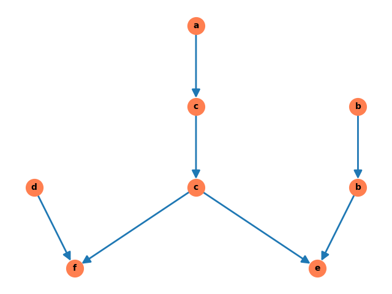

# Trace Theory project
### Jakub Barber
## Description
Project creates graphs of Dependencies D, graph of Independencies I and computes Foata Normal Form using stack algorithm presented on the lab.
After all the computations, algorithm prepares and renders Dekiert Graph for a problem specified with word w and input of actions in format:
`(a) x := y + z` each in the next line (**each one should be labeled and containing ":=" operator**).

## Requirements
In order to run the project create virtual environment and inside run:
```
pip install -r requirements.txt
```
In order to run the visualization of Dekiert graph you have to have Graphviz installed on your machine.

## Instructions
* Prepare a json file following format:
```javascript
{
    "actions": "(a) x := x + 1\n(b) y := y + 2z\n(c) x := 3x + z\n(d) w := w + v\n(e) z := y − z\n(f) v := x + v",
    "w": "acdcfbbe"
}
```
where `actions` are your labeled actions separated with `\n` and `w` is a word for given exercise.
* In `trace_theory.py` file change value of `CONFIGURATION_FILE` macro according to the name of your file.
* Run 
```
python trace_theory.py
```

## Sources
I've prepared exercise using algorithms present in [Partial Commutation and Traces](https://citeseerx.ist.psu.edu/viewdoc/download?doi=10.1.1.38.4401&rep=rep1&type=pdf). Despite of using DFS od Dekiert graph in order to compute FNF, I've used multi stack approach described on **page 10**.

## Results for example provided in the homework doc

```
RESULTS:
        D = [('a', 'a'), ('a', 'c'), ('a', 'f'), ('b', 'b'), ('b', 'e'), ('c', 'a'), ('c', 'c'), ('c', 'e'), ('c', 'f'), ('d', 'd'), ('d', 'f'), ('e', 'b'), ('e', 'c'), ('e', 'e'), ('f', 'a'), ('f', 'c'), ('f', 'd'), ('f', 'f')]
        I = [('a', 'b'), ('a', 'd'), ('a', 'e'), ('b', 'a'), ('b', 'c'), ('b', 'd'), ('b', 'f'), ('c', 'b'), ('c', 'd'), ('d', 'a'), ('d', 'b'), ('d', 'c'), ('d', 'e'), ('e', 'a'), ('e', 'd'), ('e', 'f'), ('f', 'b'), ('f', 'e')]
        FNF(|w|) = (abd)(bc)(c)(ef)
```


